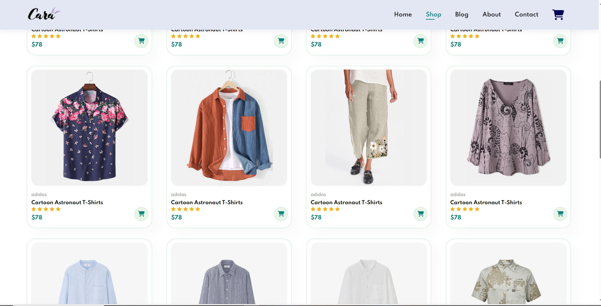

# 👗 GlowCart - Fashion E-commerce Website

A modern and responsive e-commerce website for stylish clothing lovers. Built with **HTML**, **CSS**, and **JavaScript**, this project simulates an online store with multiple pages, clean layout, and smooth user experience.

## 🚀 Live Preview

🔗 [View the Website](https://antonious-sameh.github.io/E-commerce_html_css_js/)

> Replace the link above with your GitHub Pages link after deployment.

## 📸 Preview

> Upload a screenshot of your homepage as `preview.png` in the repo root.

## 💼 Features

- Home page with banner and featured products
- Products listing page (Men, Women, etc.)
- Product details popup or page
- Add to cart simulation
- Contact & About pages
- Fully responsive design
- Modern UI/UX

## 🛠️ Tech Used

- HTML5
- CSS3
- JavaScript 
